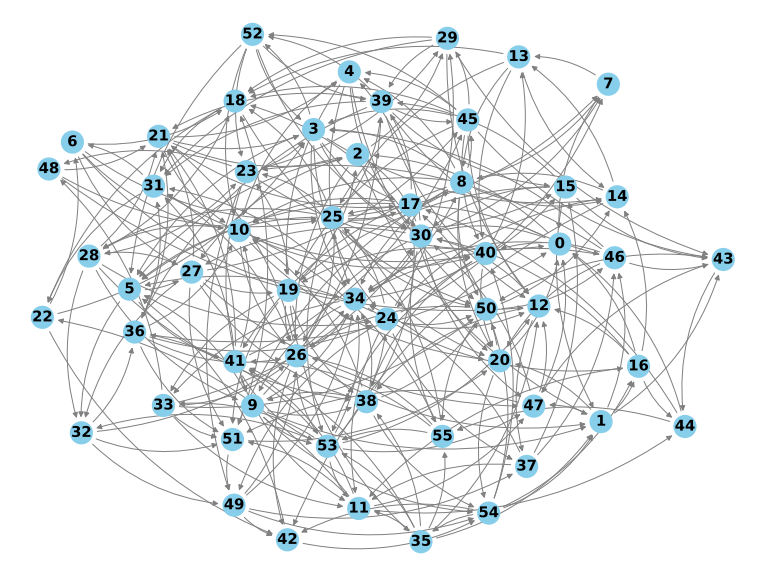
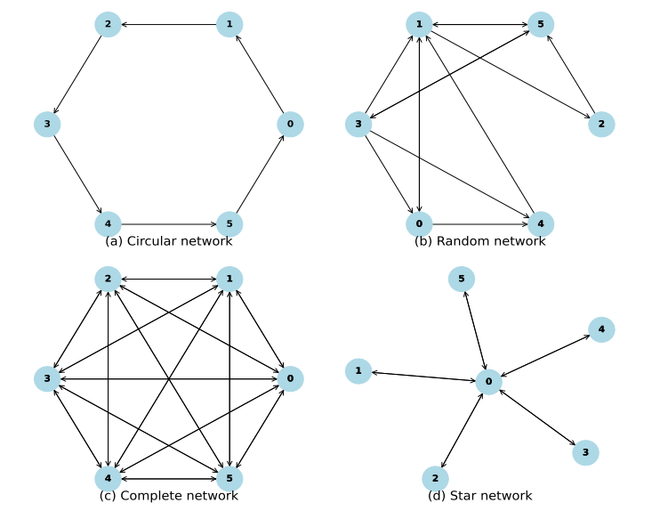

# 分布式优化算法数值仿真实验图生成器

本图生成器框架旨在为分布式优化算法的数值仿真实验提供支持，功能丰富、灵活，能够满足多种实验需求：

- **图类型支持** 🌐：
  - 提供多种常见图类型，包括:
  - 链图 `chain`、星形图 `star`、随机二叉树 `random_binary_tree`完美二叉树 `perfect_binary_tree`
  - 随机图 `random_graph`、环图 `cycle`、蜘蛛图 `spider_web` 和完全图 `full`
  - 基本涵盖了领域内大多数论文实验中使用的图结构
- **图结构灵活性** 🔄：
  - 支持固定图 `Fixed_Matrix` 与时变图 `TimeVarying_Matrix`
  - 还支持双随机矩阵 `double_stochastic`、行随机矩阵 `row_stochastic`、列随机矩阵 `column_stochastic` 等多种配置
  - 满足不同实验需求
- **自定义功能** ⚙️：用户可以根据需求自由设置图的数量、节点数量和节点密度，灵活适应多种实验场景。

本框架为分布式优化算法提供了多种场景下的图生成能力，确保您能够高效开展实验与分析。

以下是本框架的效果图，图片来自于我的 paper: [Distributed aggregative optimization over directed networks with column-stochasticity](https://www.sciencedirect.com/science/article/abs/pii/S001600322400913X)

<div style="display: inline-block; margin-right: 10px;">
  
</div>
<div style="display: inline-block;">
  
</div>


**作者** ✍️：Qixing Zhou  
**联系方式** 📧：qixingzhou1125@outlook.com  
如遇到问题或Bug，欢迎联系。

```
distributed_optimization_framework/
├── README.md
├── run_simulation.sh       # 启动运行脚本
├── config/                 # 配置文件（图结构和算法类型都在这里配置）
│   └── default_config.yaml
├── algorithms/             # 算法实现代码
│   ├── DAGT_Algorithm.py
│   ├── MDGT_Algorithm.py
│   ├── DACS_Algorithm.py
│   ├── DACS_HB_Algorithm.py
├── network_topologies/     # 网络拓扑生成代码
│   ├── Fixed_Matrix.py
│   └── Time_varying_Matrix.py
├── visualizations/         # 画图代码
│   └── plot_results.py
└── simulation.py           # 框架的主函数
``` 